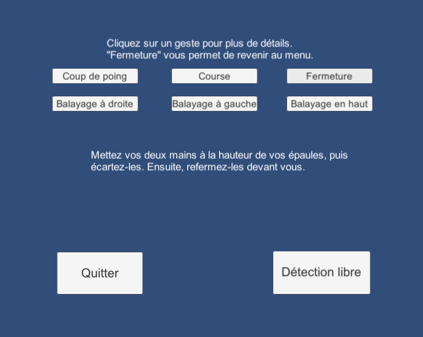
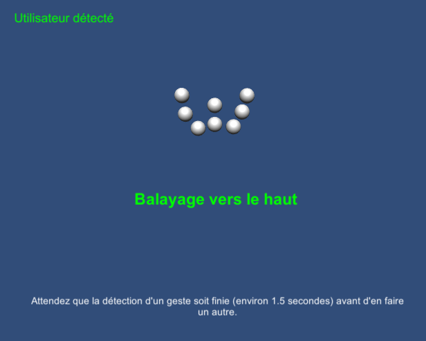
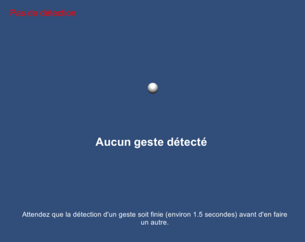

**Projet Kinect**			*Clavelin Gaëlle et Suleimanova Ramina*

**Gestes (théoriquement) reconnus :**

-*Balayage à droite* : position de départ coude droit au corps, main droite au-dessus du coude. On tend le bras vers la droite horizontalement en alignant épaule, coude, et main. Puis retour à la position de départ.

-*Balayage à gauche* : position de départ coude droit au corps, main droite au-dessus du coude. On tend le bras vers la gauche horizontalement en alignant épaule, coude, et main. Puis retour à la position de départ.

-*Balayage vers le haut* : position de départ avec les mains non écartées, en-dessous des épaules. On tend les deux bras vers le haut de façon à ce que les mains soient alignées horizontalement et au-dessus de la tête. Puis retour à la position de départ.

-*Coup de poing* : position de départ coude droit au corps, main droite au-dessus du coude. On tend le bras vers la Kinect comme si on voulait donner un coup de poing en son centre. Puis retour à la position de départ.

-*Course* : les coudes au corps, on répète 4 fois : bras gauche plié vers le haut (main gauche sur l’épaule gauche) avec bras droit et avant-bras droit à 90degrés, puis l’inverse.

-*Fermeture* : les mains à hauteur des épaules, on écarte les mains au maximum. Puis on les referme horizontalement devant soi. Ce geste sert à revenir au menu depuis la scène principale.

La durée pour effectuer chaque geste peut être réglée dans les paramètres des scripts correspondants. Après la reconnaissance d’un geste, il faut attendre un cooldown pour en faire un autre. La valeur du cooldown est réglable dans le GestureHandler.

**Solutions algorithmiques choisies pour la détection :**
Notre détection se base sur la reconnaissance de positions successives, effectuées dans un certain temps (variable ajustable). Par exemple, le geste Swiping Right commence avec le coude droit au corps, et la main au-dessus (position1). Puis on doit aligner les trois articulations du bras vers la droite (position2). Puis on retourne au début (position1).
Ainsi, le geste est reconnu si on est passé de la position 1 à la position 2 en un temps défini, puis de la position 2 à la position 1 dans ce même temps.
*Remarque* : toutes les marges utilisées pour les alignements, ainsi que les temps alloués pour chaque geste, sont ajustables dans l'inspecteur.
Une fois le geste reconnu, un évènement (UnityEvent) est envoyé au GestureHandler qui gère l’affichage et plus généralement, les actions à accomplir en réponse à un geste (par exemple, retourner au menu pour le geste Fermeture).

**Pour utiliser le package KinectPackage :**

-se placer dans une scène vide.

-instancier les trois préfabs (KinectPréfab, GestureTracker, TestKinect).

-relier les parties du corps du Tracker au Skeleton Wrapper du Kinect Prefab et mapper les parties du corps dans Kinect Point Controller (script du Tracker).

-créer des zones de texte et les relier au TestConnection et au GestureHandler pour afficher l’état de la Kinect et les gestes reconnus.

**Pour ajouter un nouveau geste :**

-créer un script NomDuGeste.cs, héritant de Gesture.cs.

-lui donner en attributs les parties du corps dont il a besoin (qu’il faudra relier aux parties du SkeletonWrapper).

-implémenter la méthode localStart (qui sera appelée par le Start de Gesture.cs) pour initialiser les variables.

-implémenter la méthode detect, qui passe le booléen isDetected à true quand le geste souhaité est détecté.

**Evaluation :**

|           | Balayage droite | Balayage gauche | Balayage haut | Coup de poing | Course | Fermeture |
|-----------|-----------------|-----------------|---------------|---------------|--------|-----------|
| Testeur 1 | 100%            | 100%            | 80%           | 100%          | 60%    | 100%      |
| Testeur 2 | 100%            | 100%            | 100%          | 100%          | 80%    | 40%       |

On remarque que la reconnaissance de certains gestes est moins bonne (course et fermeture), car ils sont plus difficiles à expliquer et donc à reproduire exactement. De plus, on voit que selon le testeur, certains gestes ont des résultats variables (fermeture : 2 fois sur 5 pour un testeur, à chaque fois pour l’autre).
